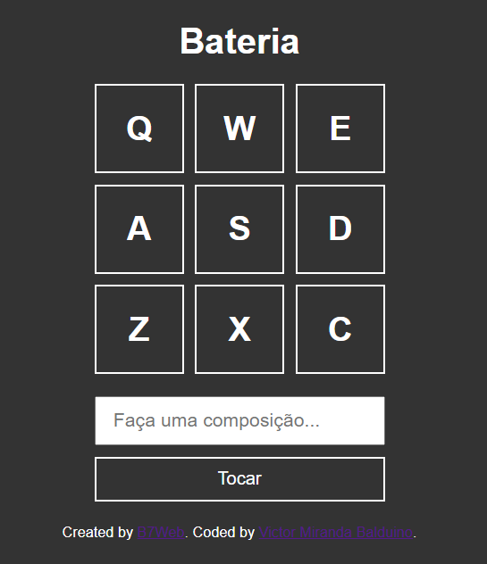
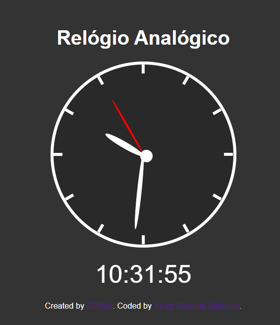
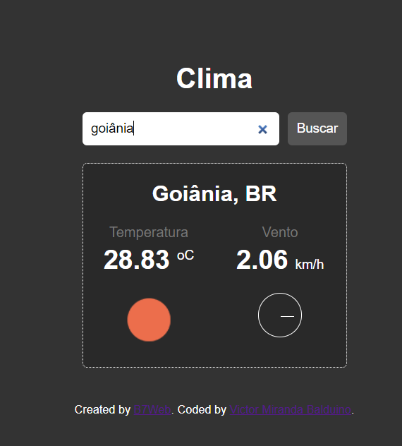
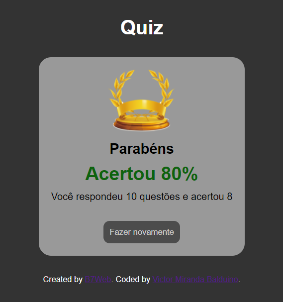
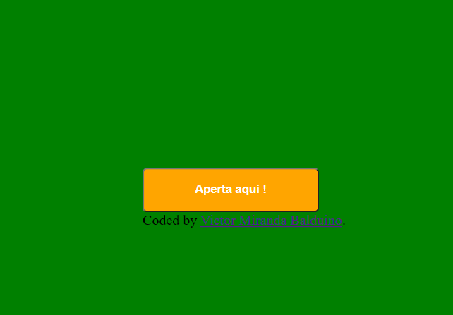

# Vários Projetos/Desafios em JavaScript

## Sites dos desafios
 - [B7Web](https://b7web.com.br/fullstack/?ref=I24108426I&gclid=Cj0KCQjw7MGJBhD-ARIsAMZ0eetnVPns4VA30m5Jl4VE15oOA2nRe8FpGNaEfbPqcIhu3iCTNqWW06oaAhE6EALw_wcB)
 - [JS Beginners](https://jsbeginners.com/javascript-projects-for-beginners/)
 - [Frontend Mentor](https://www.frontendmentor.io/challenges)

## Lista de Projetos em JavaScript
 - Projeto 1: [Bateria](/projeto01)  
    
 - Projeto 2: [Relógio](/projeto02)  
    
 - Projeto 3: [Temperatura](/projeto03)  
    
 - Projeto 4: [Quiz](/projeto04)  
    
 - Projeto 5: [Change Background Color](/projeto05)  
    